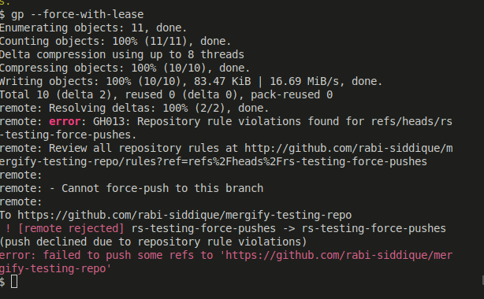
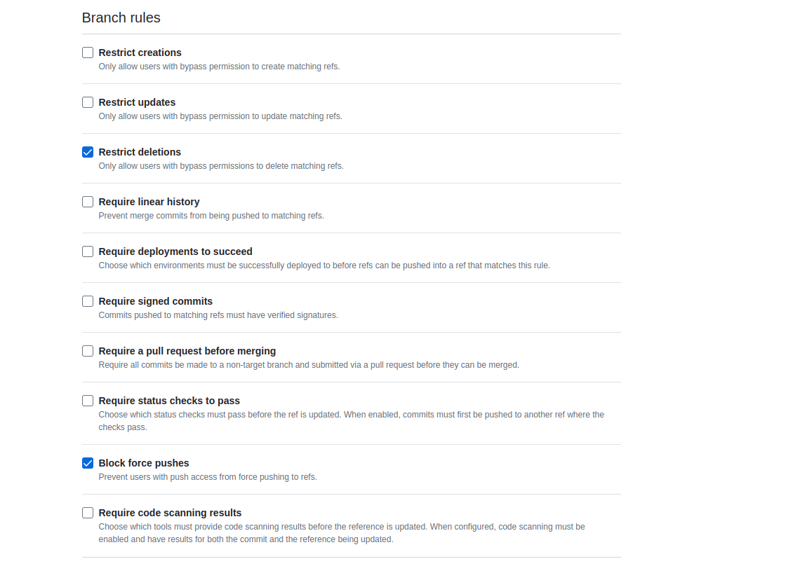

# Branch Protection Rules

Branch protection rules help you control who can make changes to certain branches in your repository. They help us ensure certain checks or processes are completed before changes can be made to a branch.

For example, before merging a pull request into the branch.

# Default Settings

A branch protection rule by default allows:

- `No Force Pushes`: You can’t forcefully push changes to the protected branches. For example, if I `git rebase -i HEAD~3` and try to reword a commit message and then try to `git push --force`, it won't work. And give this error:
  
  More about it [over here](https://docs.github.com/en/repositories/configuring-branches-and-merges-in-your-repository/managing-protected-branches/about-protected-branches#allow-force-pushes).
- `No Deleting`: The protected branches can’t be deleted.

